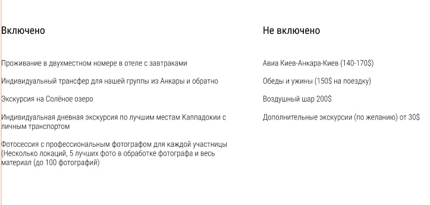
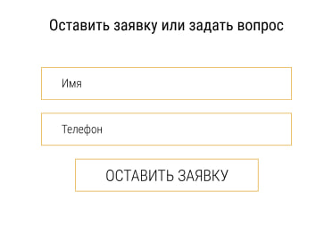

# BEM
 Github Branching Workout

## BEM

### Голова
```
.голова

.голова__глаз

.голова__уши--проколотые
```
### Рука

```
.рука

.рука__локоть

.рука__ладонь--рана
```
### Тело

```
.тело

.тело__грудь

.тело__грудь--татуировка
```

## Вариант 4


```
header.header>(nav.header__navigation.navigation>a.navigation__link*3)+a.header__contact
```


```
section.price>(ul.price__list>li.price__item*5)+(ul.price__list>li.price__item*3)
```



```
section.feedback>form.feedback>(label.feedback__shell>input.feedback__input)*2+input.feedback__submit
```


```
footer.footer>h2.footer__title+(ul.footer__list>li.footer__item*2>img.footer__icon+a.footer__link)+ul.footer__social-list>li.footer__social-item*3>img.footer__social__icon
```
